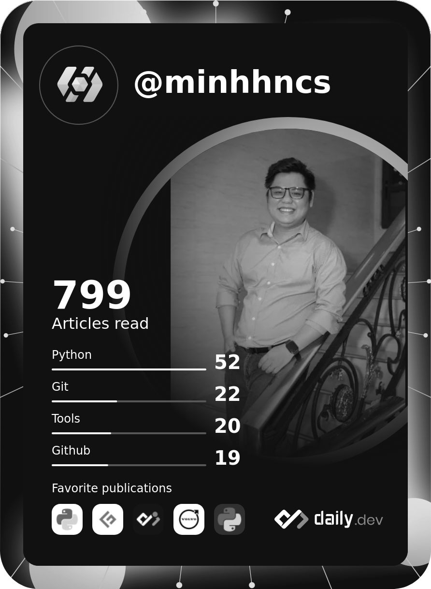

# Hello there, I'm Minh - Huynh Nhat Minh 🙋‍
## QA/QC in Automation Team (04.2020 - 10.11.2023)

### Farewell

Over the past three years, starting from April 2020 until November 2023, my journey at Floware VN has been a rollercoaster of emotions. I have experienced moments of joy, times of sadness, countless bursts of laughter, and it all comes to an end now, leaving me with a sense of nostalgia.

I have had the privilege to work with an amazing team that not only supported me through the professional challenges but also became a source of friendship and shared laughter. The highs of celebrating our successes, hitting milestones, and achieving our goals were pure joy. On the other hand, there were lows when we faced setbacks and obstacles that tested our resilience. Through it all, the camaraderie among my colleagues and the support of my superiors made these challenging times more manageable.

As I bid farewell to my time at Floware VN, I can't help but feel a deep sense of nostalgia and gratitude for the experiences I've gained here. It's not just about the work; it's about the people, the memories, and the growth that I've experienced. If anyone would like to stay in touch or reach out to me in the future, please feel free to contact me via email or Skype. I look forward to keeping these connections alive even as I move on to new adventures.

---

### Contact with me: 
- &#9898;   Flomail: minhhn1112@flomail.net
- &#128994; Skype  : live:minhhncs

## Tech Stack 🛠

## Find me around the web 💻👨‍💻

 
 
 
 
 
 
 
 

### Spotify Playing with me 🎧

<!--
**minhhngr/minhhngr** is a ✨ _special_ ✨ repository because its `README.md` (this file) appears on your GitHub profile.

Here are some ideas to get you started:

- 🔭 I’m currently working on ...
- 🌱 I’m currently learning ...
- 👯 I’m looking to collaborate on ...
- 🤔 I’m looking for help with ...
- 💬 Ask me about ...
- 📫 How to reach me: ...
- 😄 Pronouns: ...
- ⚡ Fun fact: ...
-->
